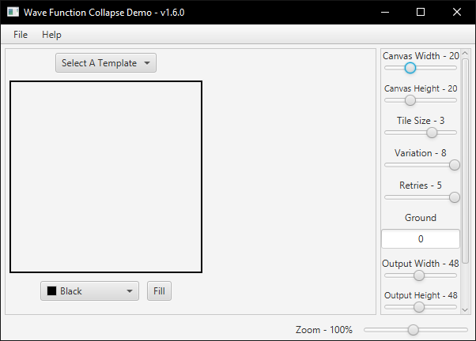

<h1 align="center">Wave Function Collapse JavaFX</h1>
<p align="center">
<a href="https://www.oracle.com/java/"></a>
</p>

<hr>

## 📋 Requirements
- [Java JDK 18](https://jdk.java.net/18/)
- [JavaFX 18](https://gluonhq.com/products/javafx/)
- [Maven >= 3.8.1](https://maven.apache.org/download.cgi)

## 💻 Usage
```shell
mvn clean
mvn package

mvn javafx:run
```

## 📱 The App


### Features
- Full control over canvas coloring, size, and height
- Control over algorithm tile size and variation, as well as ability to set ground (right click on canvas)
- Control over output width/height, as well as saving the output
- Ability to import a pattern (<50x50 in size)
- Built-In Templates
- Zooming in/out